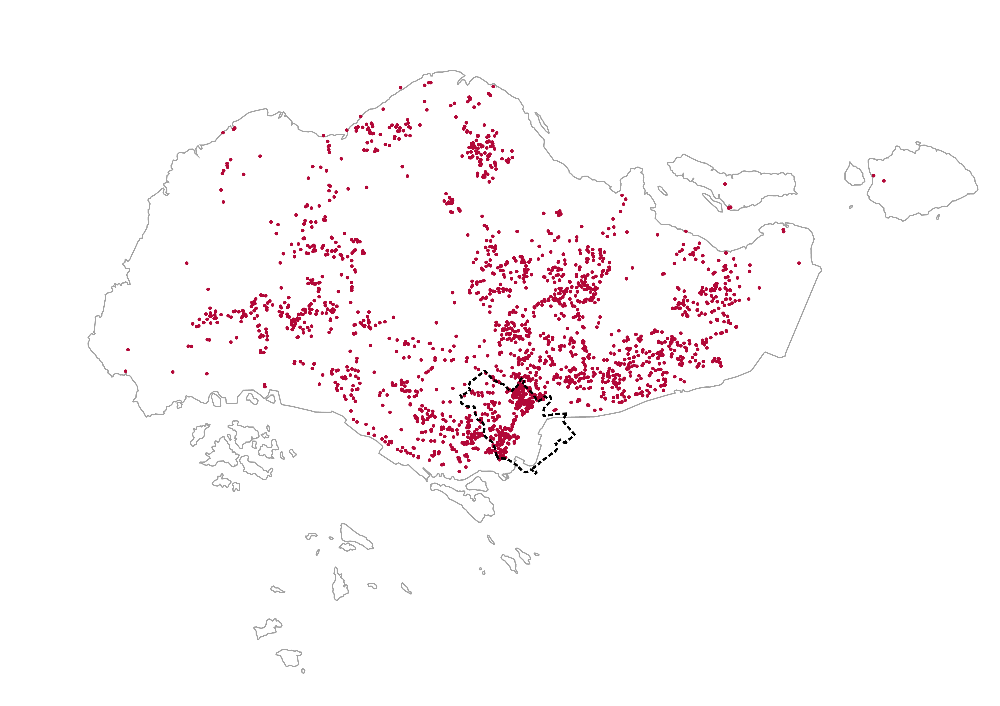
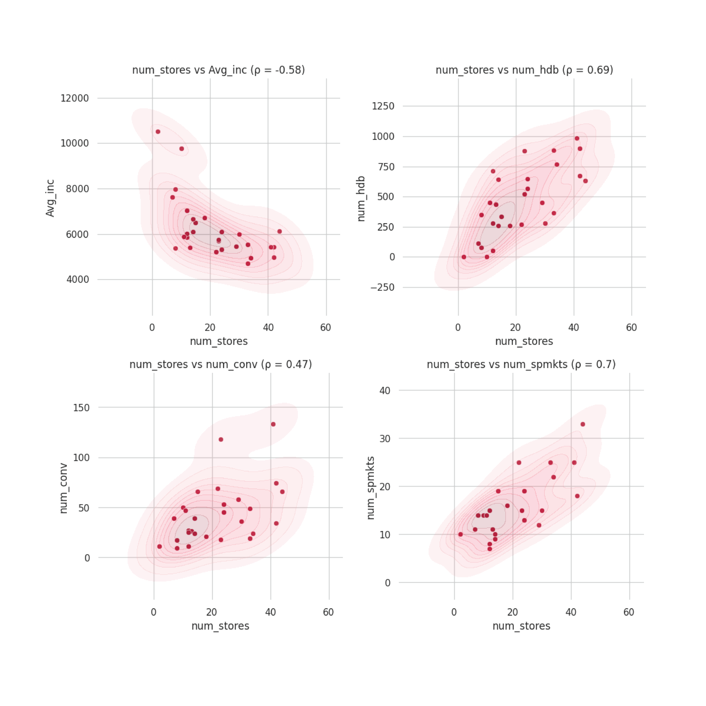
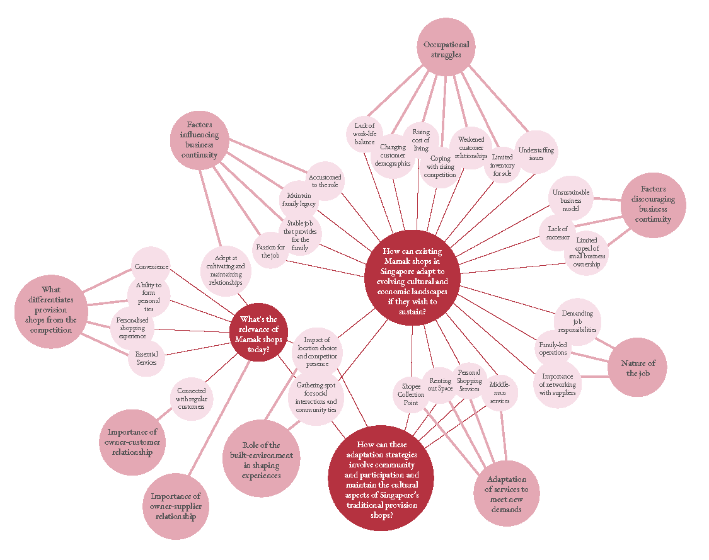

# Research Projects

Hello! Welcome to my portfolio repository. These are the workings of some projects during my stint as a Senior Research Asst. at SUTD (and my graduation thesis from TU Delft). My work here delved into urban challenges of modern cities and the different approaches used to tackle them: community engagement through participatory design, GIS and data science. Each link leads to an elaboration of each phase and the documentation in code. 

 

  <a href="https://urbanjeans.github.io/dfn-dashboard" target="_blank" class="card-link">
    

      
      

        Good Public Spaces: Mapping natural habitats in Singapore with remote sensing and government datasets
      

    

  </a>

  <a href="https://urbanjeans.github.io/dfn-dashboard" target="_blank" class="card-link">
    

      
      

        Good Public Spaces: Mapping accessibility of nature spaces across Singapore
      

    

  </a>

  <a href="https://urbanjeans.github.io/dfn-dashboard" target="_blank" class="card-link">
    

      
      

        The Modern Mamak: mapping mamak shops since the 1980s
      

    

  </a>

  <a href="https://urbanjeans.github.io/dfn-dashboard" target="_blank" class="card-link">
    

      
      

        The Modern Mamak: Exploritory Data Analsyis (EDA) of mamak shops in Singapore
      

    

  </a>

  <a href="https://urbanjeans.github.io/dfn-dashboard" target="_blank" class="card-link">
  

    
    

      The Modern Mamak: Preliminary analysis of interviews and shop owners' participation
    

  

</a>

